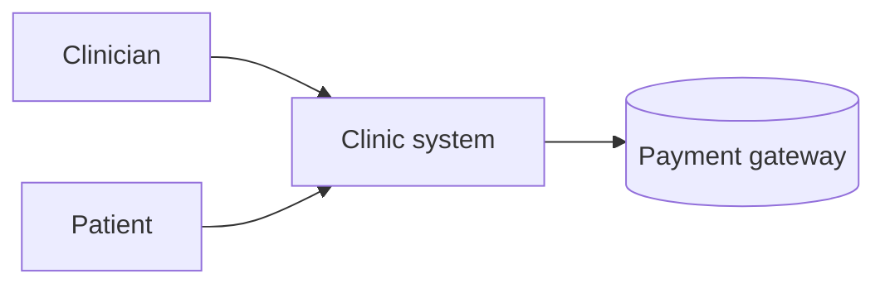

# Fixture Design

## 1. Context

The system has two actors.

```mermaid
%% alt: Context diagram: a clinician and a patient use the clinic system, which calls the payment gateway.
%% caption: System context
flowchart LR
  C[Clinician] --> S[Clinic system]
  P[Patient] --> S
  S --> G[(Payment gateway)]
```
