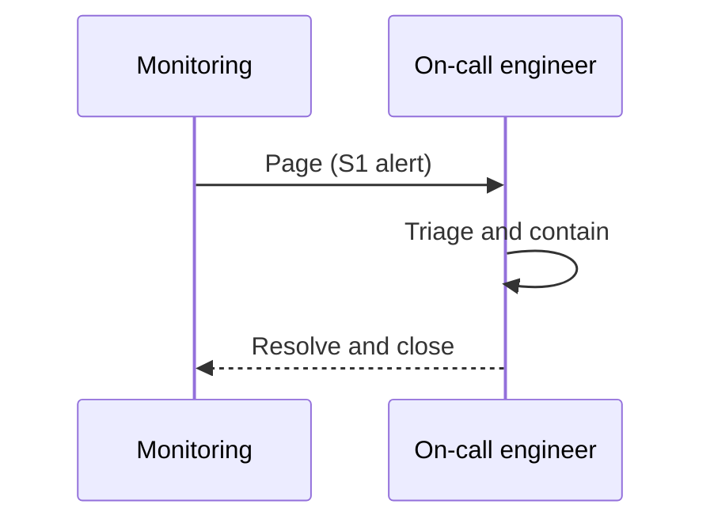

## 2. Incident response flow

```mermaid
sequenceDiagram
  participant M as Monitoring
  participant O as On-call engineer
  M->>O: Page (S1 alert)
  O->>O: Triage and contain
  O-->>M: Resolve and close
```
